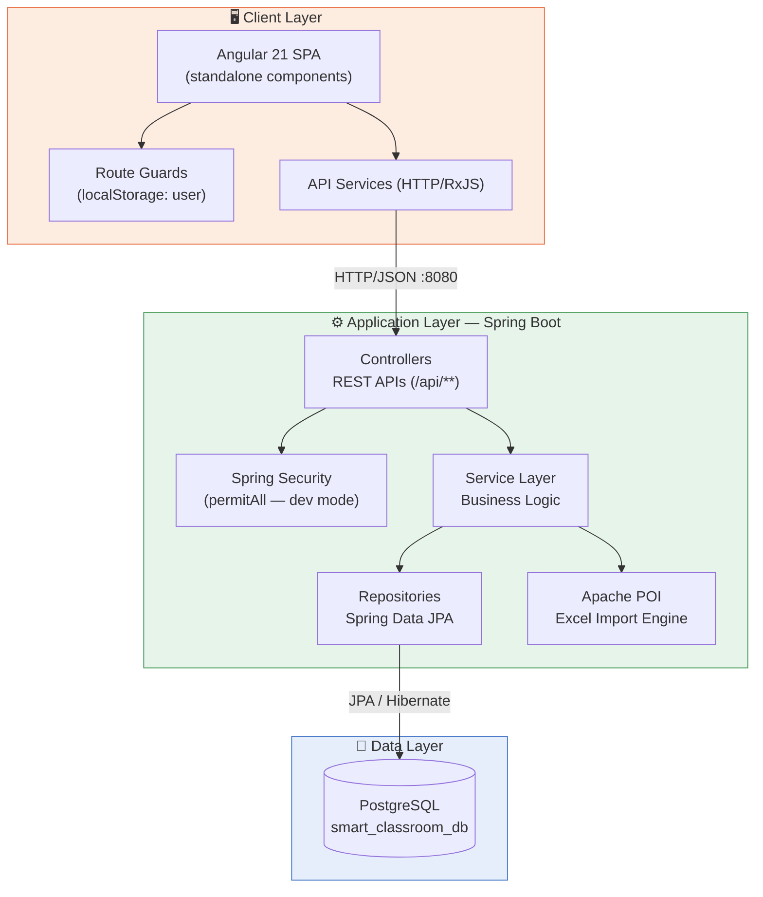

# 🏫 Class Management — Smart Classroom

> A full-stack classroom and room-allocation management system built for modern institutions — manage faculty, rooms, timetables, and requests, all in one place.


---

## ✨ Overview

**Smart Classroom** is a complete classroom and room-allocation platform that brings together login and role-based dashboards, faculty and room administration, timetable scheduling, room-booking workflows, real-time notifications, audit logging, and Excel-based bulk data uploads — powered by a **Spring Boot** backend and an **Angular** frontend.

---

## 🚀 Features

- 🔐 **Secure Login & Authentication** — role-based access with password change support
- 📊 **Dashboard Insights** — at-a-glance metrics for admins and faculty
- 👩‍🏫 **Faculty Management** — add, update, and remove faculty records
- 🏢 **Room Management** — manage rooms and instantly check availability
- 🗓️ **Timetable Scheduling** — create, update, and view timetables per faculty
- 📥 **Room Request Workflow** — faculty can request rooms; admins approve or reject
- 📚 **Subject Management** — maintain the list of subjects offered
- 🔔 **Notifications** — keep users informed of key events and updates
- 🧾 **Audit Logging** — track important system actions for accountability
- 📈 **Excel Bulk Uploads** — import faculty, room, and timetable data in bulk via Apache POI
- 🖥️ **Guarded Routing** — protected pages for authenticated users only
- 🎨 **Modern Angular UI** — built with standalone components for a clean, modular frontend

---

## 🏗️ Architecture

Smart Classroom follows a classic **three-tier architecture** — a decoupled Angular SPA talking to a Spring Boot REST API, backed by PostgreSQL.



### Layer Breakdown

| Layer | Responsibility |
|---|---|
| **Presentation (Angular)** | Renders pages, guards protected routes, and talks to the backend via typed API services over HTTP |
| **API (Controllers)** | Exposes REST endpoints for auth, faculty, rooms, timetable, requests, subjects, notifications, audit, and uploads |
| **Business Logic (Services)** | Validates rules, orchestrates workflows (e.g. room request → approval → notification) |
| **Persistence (Repositories)** | Spring Data JPA repositories mapping entities to PostgreSQL tables |
| **File Processing** | Apache POI parses uploaded Excel files for bulk faculty/room/timetable creation |
| **Database (PostgreSQL)** | Stores all domain entities: `User`, `Faculty`, `Room`, `Timetable`, `RoomRequest`, `Notification`, `AuditLog`, `Subject`, `Material` |

### Request Flow Example — Room Booking

1. Faculty submits a room request from the Angular UI (`POST /api/requests`)
2. Controller delegates to the service layer for validation (availability, conflicts)
3. Repository persists the request via JPA
4. Admin reviews and approves/rejects it (`PUT /api/requests/{id}/approve`)
5. A notification is generated and fetched by the faculty dashboard (`GET /api/notifications/{userId}`)
6. The action is recorded in the audit log (`GET /api/audit`)

---

## 🧱 Tech Stack

| Layer | Technology |
|---|---|
| **Backend** | Java 17, Spring Boot 4.1.0, Spring Web MVC, Spring Data JPA, Spring Security |
| **Database** | PostgreSQL |
| **File Handling** | Apache POI (Excel uploads) |
| **Frontend** | Angular 21, TypeScript 5.9, RxJS |
| **Testing** | Vitest (`ng test`) |

---

## 📂 Project Structure

```text
Class-management/
├── smartclassroom/                          # Spring Boot backend
│   ├── src/main/java/com/smartclassroom/
│   │   ├── config/                          # Security configuration
│   │   ├── controller/                      # REST APIs
│   │   ├── dto/                             # Request/response DTOs
│   │   ├── entity/                          # JPA entities
│   │   ├── repository/                      # Spring Data repositories
│   │   └── service/                         # Business logic
│   └── src/main/resources/application.properties
└── AngularProjects/smart-classroom-ui/      # Angular frontend
    ├── src/app/pages/                       # Page components
    ├── src/app/services/                    # API services
    ├── src/app/guards/                      # Route guards
    └── src/environments/environment.ts
```

---

## ⚙️ Prerequisites

- ☕ Java 17
- 📦 Maven (or the included `./mvnw`)
- 🐘 PostgreSQL
- 🟢 Node.js + npm (npm 10+ recommended)
- 🅰️ Angular CLI *(optional — a local CLI is already bundled)*

---

## 🛠️ Getting Started

### 1. Backend (Spring Boot)

**Configure the database** in:
`smartclassroom/src/main/resources/application.properties`

```properties
spring.datasource.url=jdbc:postgresql://localhost:5432/smart_classroom_db
spring.datasource.username=postgres
spring.datasource.password=your_password
spring.jpa.hibernate.ddl-auto=update
server.port=8080
```

Create the database:
```sql
CREATE DATABASE smart_classroom_db;
```

Run the backend from `smartclassroom/`:
```bash
./mvnw spring-boot:run
```

Backend runs at → `http://localhost:8080`

Run backend tests:
```bash
./mvnw test
```

### 2. Frontend (Angular)

From `AngularProjects/smart-classroom-ui/`:

```bash
npm install
npm start
```

Frontend runs at → `http://localhost:4200`

Verify the API base URL in `src/environments/environment.ts`:
```ts
apiUrl: 'http://localhost:8080'
```

Run frontend tests / build:
```bash
npm test
npm run build
```

---

## 🧭 Application Routes

| Route | Description |
|---|---|
| `/` | Landing page |
| `/login` | Login |
| `/admin-dashboard` | Admin dashboard 🔒 |
| `/faculty-dashboard` | Faculty dashboard 🔒 |
| `/faculty-management` | Faculty management 🔒 |
| `/room-management` | Room management 🔒 |
| `/timetable` | Timetable 🔒 |
| `/room-request` | Room request creation/approval 🔒 |
| `/my-requests` | Faculty request history 🔒 |
| `/change-password` | Password update 🔒 |

🔒 = protected by the auth guard (checks the `user` key in `localStorage`)

---

## 🔌 API Reference

| Module | Base Path | Endpoints |
|---|---|---|
| **Auth** | `/api/auth` | `POST /login`, `POST /change-password` |
| **Dashboard** | `/api/dashboard` | `GET /` |
| **Faculty (Admin)** | `/api/admin` | `GET/POST /faculty`, `PUT/DELETE /faculty/{id}` |
| **Rooms** | `/api/rooms` | `GET /`, `GET /available`, `POST /`, `PUT/DELETE /{id}` |
| **Timetable** | `/api/timetable` | `GET/POST /`, `PUT /{id}`, `GET /faculty/{facultyId}`, `DELETE /{id}` |
| **Room Requests** | `/api/requests` | `GET/POST /`, `PUT /{id}/approve`, `PUT /{id}/reject`, `GET /faculty/{facultyId}` |
| **Subjects** | `/api/subjects` | `GET /`, `POST /` |
| **Notifications** | `/api/notifications` | `GET /{userId}` |
| **Audit** | `/api/audit` | `GET /` |
| **Excel Uploads** | `/api/upload` | `POST /faculty`, `POST /rooms`, `POST /timetable` |

---

## 🗃️ Domain Entities

`User` · `Faculty` · `Room` · `Timetable` · `RoomRequest` · `Notification` · `AuditLog` · `Subject` · `Material`

---

## 📋 Typical Local Run Order

1. Start PostgreSQL
2. Create the `smart_classroom_db` database
3. Configure DB credentials in `application.properties`
4. Start the backend — `./mvnw spring-boot:run`
5. Start the frontend — `npm install && npm start`
6. Open `http://localhost:4200` and log in 🎉

---

## 📝 Notes

- 🔓 Security is currently configured with `permitAll()` for local development.
- 🔄 JPA `ddl-auto=update` is enabled for convenient local iteration.
- 🔑 Keep credentials and secrets out of committed files — use secure configuration for real deployments.

---

<p align="center">Made with ☕ and Angular for smarter classrooms.</p>
